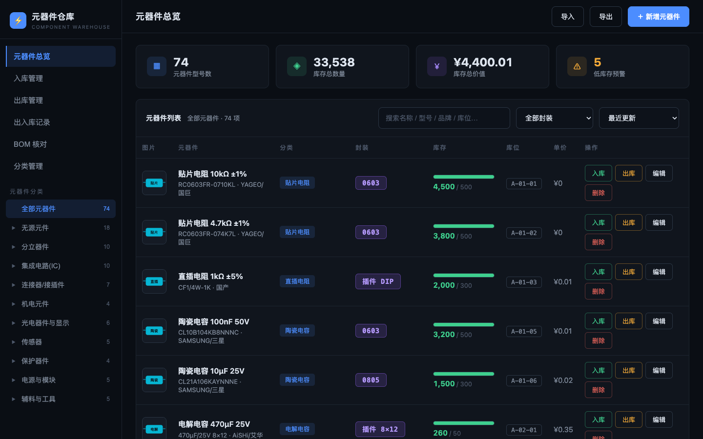
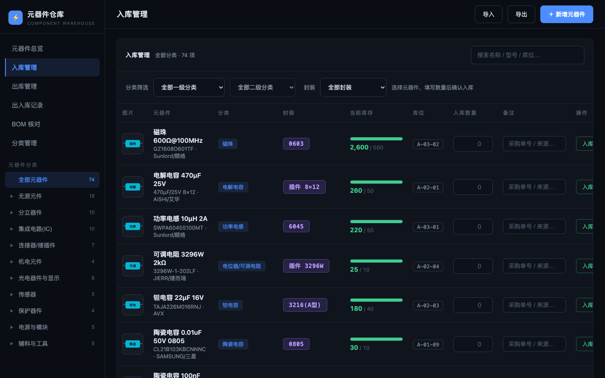
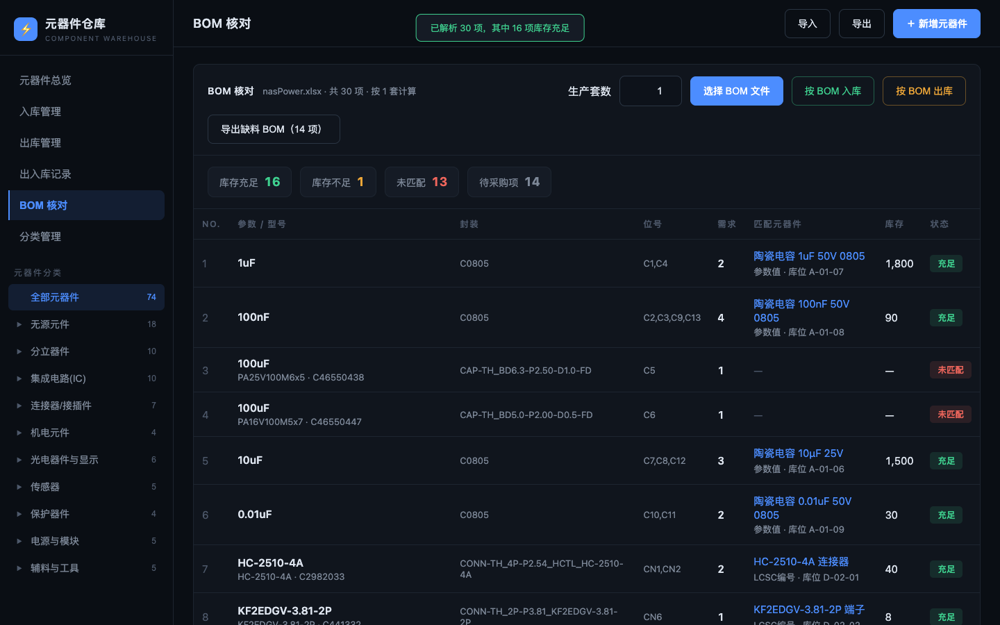
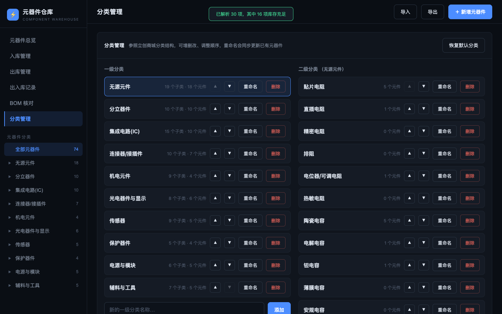

# RCL Studio — 元器件仓库管理系统 (Component Warehouse Manager)

一个**纯前端、零依赖、单文件**的电子元器件库存管理系统，面向电子爱好者与硬件工程师。
无需安装、无需联网、无需后端 —— 下载 `index.html` 双击即用。

## 功能特性

- **元器件总览**：立创商城风格两级分类树、搜索、封装级联筛选、库存进度条（当前库存 / 最低库存）、低库存预警、库位管理
- **入库 / 出库管理**：独立页面，一级分类 → 二级分类 → 封装逐级级联筛选，超库存拦截，操作留痕
- **出入库记录**：完整流水，可按类型筛选，BOM 批量操作自动备注来源
- **BOM 核对**：直接导入立创EDA 导出的 BOM（.xlsx / .csv，内置解析器无需任何库），与仓库库存自动比对（LCSC编号 → 制造商型号 → 参数值 三级匹配），支持生产套数倍数
  - 一键导出缺料 BOM（库存不足 + 未匹配项，含缺口数量）
  - **按 BOM 出库**：焊接完成后一键扣减全部用料
  - **按 BOM 入库**：采购到货后一键入库全部物料
- **分类管理**：两级分类增删改、上下移排序，重命名自动同步已有元件
- **元件资料**：每个元件可上传图片（自动压缩）与数据手册（Datasheet，PDF 等，点击即开）
- **数据备份**：JSON 一键导出 / 导入，数据完整迁移
- **中英双语**：顶栏一键切换 中文 / English，界面文案完整翻译，选择自动记忆
- **日间 / 夜间主题**：顶栏一键切换，暗色扁平与浅色扁平双主题，选择自动记忆

## 截图

| 元器件总览 | 入库管理 |
| --- | --- |
|  |  |

| BOM 核对 | 分类管理 |
| --- | --- |
|  |  |

## 快速开始

1. 下载本仓库的 `index.html`（或克隆整个仓库）
2. 用 Chrome / Edge 打开即可使用
3. 首次打开自带 70+ 个演示元件，方便体验；清除浏览器站点数据即可重置

## 数据存储

所有数据保存在浏览器本地，**不会上传到任何服务器**：

- 元器件、出入库流水、图片、数据手册 → IndexedDB
- 分类结构 → localStorage

换电脑 / 换浏览器前，请使用页面右上角「导出」备份 JSON，到新环境「导入」即可恢复。

## 技术说明

- 单个 `index.html` 包含全部 HTML / CSS / JS，零外部依赖
- xlsx 解析为内置极简实现（ZIP 中央目录 + DEFLATE 解压 + XML 解析），支持立创EDA 标准 BOM 格式
- 暗色扁平化 UI，大字体大控件，封装高亮徽章
- 内置 i18n 字典（`data-i18n` 属性 + `T()`/`TF()` 函数），支持 中文 / English 切换并持久化

## License

[MIT](LICENSE)
